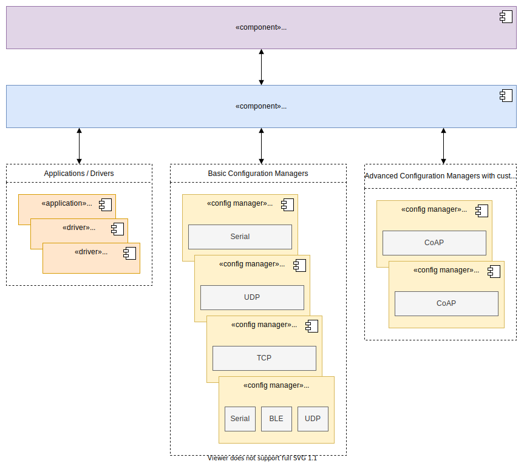

RIOT Runtime Config / RIOT Registry
===================================

## Abstract
This memo describes the proposed high-level architecture and
mechanisms to implement a runtime configuration system on a RIOT node.

A runtime configuration system is in charge of providing a mechanism to set and
get the values of configuration parameters that are used during the execution
of the firmware, as well as a way to persist these values. Runtime
configurations are deployment-specific and can be changed on a per node basis.
Appropriate management tools could also enable the configuration of node
groups.

Examples of runtime configurations are:
- Transmission duty cycles
- Sensor thresholds
- Security credentials
- System state variables

These parameters might have constraints, like a specific order to be applied
(due to interdependencies) or value boundaries.

The main advantages of having such a system are:
- Easy to apply per-node configuration during deployment
- No need to implement a special mechanism for per-node configurations during
  firmware updates (only in the case of migration), as the parameters persist.
- Common interface for modules to expose their runtime configuration parameters
  and handle them
- Common interface for storing configuration parameters in non-volatile
  storage devices

## Status
This document is currently under open discussion. This document is a product of
[Configuration Task
Force](https://github.com/RIOT-OS/RIOT/wiki/Configuration-Task-Force-(CTF)), and
aims to describe the architecture of a runtime configuration system. The content
of this document is licensed with a Creative Commons CC-BY-SA license.

## Terminology
This memo uses the [RFC2119](https://www.ietf.org/rfc/rfc2119.txt) terminology
and the following acronyms and definitions:

### Acronyms
- RDM: RIOT Developer Memo
- CTF: RIOT Configuration Task Force
- RCS: Runtime Configuration System
- RS: Registry Schema
- SI: Schema Instance
- SF: Storage Facility

### Definitions
- Configuration group: A set of key-value configurations with the same naming
 scheme and under the same scope. E.g `LIGHT_SENSOR_THRESHOLD` and
`TRANSMISSION_PERIOD` configuration parameters can be contained in an
_Application_ configuration group, as well as `IEEE802154_CHANNEL` and
`IEEE802154_TX_POWER` in an _IEEE802.15.4 Radio_ configuration group.
Within RIOT, each Configuration Group is represented by a Registry Handler.

- Registry Schema: A descriptor that acts as an interface between the RIOT
Registry and a module that exposes configurations. It provides a common
interface to `get` and `set` configurations of a given instance and provides Meta-Data for each configuration parameter `(type, name, description, ...)` as a tree structure. A RS can have multiple Schema Instances (SI).

- Schema Instance: An instance of a RS, containing the configuration parameter values. Different `modules/drivers` can use their own SI of the same RS.

- Storage Facility: A descriptor that acts as an interface between the RIOT
Registry and a non-volatile storage device. It provides a common interface to
`load` and `store` key-value data from storage devices that might have different
data representations.

# 1. Introduction
This document specifies the proposed architecture by the
Configuration Task Force (CFT) to implement a secure and reliable Runtime
Configuration System (RCS) focusing on modularity, reuse of existing
technologies in RIOT (network stack, storage interface) and standards
compliance.

# 2. Architecture
The proposed RCS architecture, as shown in Figure 01, is formed by one or more
[Configuration Managers](#4-configuration-managers) and the
[RIOT Registry](#3-the-riot-registry).

The RIOT Registry acts as common interface to access Runtime Configurations and
store them in non-volatile devices.

All runtime configuration can be accessed either from the RIOT Application or
the interfaces exposed by the Configuration Managers, via the RIOT Registry.

A RIOT Application may interact with a Configuration Manager in order to
modify access control rules or enable different exposed interfaces.

Figure 01 - Runtime Configuration System architecture

The diagram differentiates between 2 different kinds of Configuration Managers:
- `Basic Configuration Managers`: These Configuration Managers are a simple representation of the default configuration structure of the RIOT registry. They only expose the parameters paths as is and do not map to any special structure.
- `Advanced Configuration Managers`: These Configuration Managers have their own configuration structure (custom pre defined object models etc.) and can not automatically be maped to from the RIOT Registry itself. To make them work, a custom maping module needs to be implemented, which maps each configuration parameter from the registry to the correct format of the configuration manager.

