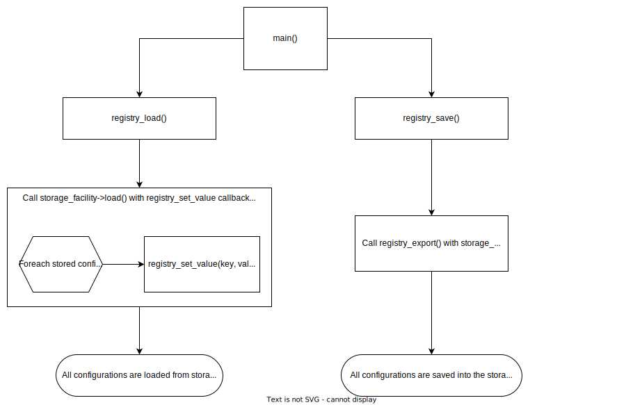
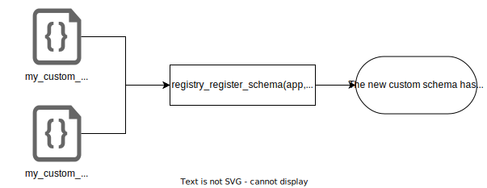

# RIOT Runtime Config / RIOT Registry

## Abstract

This memo describes the proposed high-level architecture and
mechanisms to implement a runtime configuration system on a RIOT node.

A runtime configuration system is in charge of providing a mechanism to set and
get the values of configuration parameters that are used during the execution
of the firmware, as well as a way to persist these values. Runtime
configurations are deployment-specific and can be changed on a per node basis.
Appropriate management tools could also enable the configuration of node
groups.

Examples of runtime configurations are:

- Transmission duty cycles
- Sensor thresholds
- Security credentials
- System state variables

These parameters might have constraints, like a specific order to be applied
(due to interdependencies) or value boundaries.

The main advantages of having such a system are:

- Easy to apply per-node configuration during deployment
- No need to implement a special mechanism for per-node configurations during
  firmware updates (only in the case of migration), as the parameters persist.
- Common interface for modules to expose their runtime configuration parameters
  and handle them
- Common interface for storing configuration parameters in non-volatile
  storage devices

## Status

This document is currently under open discussion. This document is a product of the
[Configuration Task
Force](https://github.com/RIOT-OS/RIOT/wiki/Configuration-Task-Force-(CTF)), and
aims to describe the architecture of a runtime configuration system. The content
of this document is licensed with a Creative Commons CC-BY-SA license.

## Terminology

This memo uses the [RFC2119](https://www.ietf.org/rfc/rfc2119.txt) terminology
and the following acronyms and definitions:

### Acronyms

- RDM: RIOT Developer Memo
- CTF: RIOT Configuration Task Force
- RCS: Runtime Configuration System
- CP: Configuration Path
- CS: Configuration Schema
- SI: Schema Instance
- SF: Storage Facility

### Definitions

- __Configuration Path__: A complete configuration path (CP) is a unique identifier of a configuration parameter. It is used to tell the registry, which root configuration group, configuration schema, schema instance etc. are currently addressed. The registry needs this information, so that it knows where to look for the requested values etc. Below is an regex example showing how the configuration path is structured. All path elements have to be integers:
 `root_group_id/schema_id/instance_id/(group_id/)*parameter_name`\
In reality the amount of "group_ids" is limited to 8 and can be changed with a `define`, so the regex is a bit simplified.

- __Root Configuration Group__: A root group, that splits configuration schemas in 2 categories: `SYS=0` and `APP=1`. Configuration schemas that are part of `SYS` are RIOT internal configuration schemas that are used to abstract common configuration structures within RIOT like `IEEE802154` etc.
The `APP` root configuration group must not be used by RIOT itself, but only by the application. This is to prevent application specific schemas from clashing with RIOT internal schemas, if RIOT gets updated.

- __Configuration Schema__: A descriptor that acts as an interface between the RIOT Registry and a module that exposes configurations. It provides a common interface to `get` and `set` configurations of a given instance and provides Meta-Data for each configuration parameter `(type, name, description, ...)` as a tree structure. A CS can have multiple Schema Instances (SI).

- __Schema Instance__: An instance of a CS (Configuration Schema), containing the configuration parameter values. Different `modules/drivers` can use their own SI of the same CS.

- __Configuration Group__: A set of key-value configurations under the same scope. E.g `LIGHT_SENSOR_THRESHOLD` and
`TRANSMISSION_PERIOD` configuration parameters can be contained in an
*Application* configuration group, as well as `IEEE802154_CHANNEL` and
`IEEE802154_TX_POWER` in an *IEEE802.15.4 Radio* configuration group.
Within RIOT, each configuration schema contains one configuration group. And each configuration group can contain multiple sub configuration groups.

- __Storage Facility__: A descriptor that acts as an interface between the RIOT Registry and a non-volatile storage device. It provides a common interface to `load` and `store` key-value data from storage devices that might have different data representations.

# 1. Introduction

This document specifies the proposed architecture by the
Configuration Task Force (CFT) to implement a secure and reliable Runtime
Configuration System (RCS) focusing on modularity, reuse of existing
technologies in RIOT (network stack, storage interface) and standards
compliance.

# 2. Architecture

The proposed RCS architecture, as shown in Figure 01, is formed by one or more
[Configuration Managers](#4-configuration-managers) and the
[RIOT Registry](#3-the-riot-registry).

The RIOT Registry acts as common interface to access Runtime Configurations and
store them in non-volatile devices.

All runtime configuration can be accessed either from the RIOT Application or
the interfaces exposed by the Configuration Managers, via the RIOT Registry.

A RIOT Application may interact with a Configuration Manager in order to
modify access control rules or enable different exposed interfaces.


<p align="center">
Figure 01 - Runtime Configuration System architecture
</p>

The diagram differentiates between 2 different kinds of Configuration Managers:

- `Basic Configuration Managers`: These Configuration Managers are a simple representation of the default configuration structure of the RIOT registry. They only expose the parameters paths as is and do not map to any special structure.
- `Advanced Configuration Managers`: These Configuration Managers have their own configuration structure (custom pre defined object models etc.) and can not automatically be mapped to from the RIOT Registry itself. To make them work, a custom mapping module needs to be implemented, which maps each configuration parameter from the registry to the correct format of the configuration manager.

# 3. The RIOT Registry

The RIOT Registry is a module for interacting with __persistent key-value configurations__. It's heavily inspired by the
[Mynewt Config subsystem](https://mynewt.apache.org/latest/os/modules/config/config.html)

The RIOT Registry interacts with RIOT modules via
[Configuration Schemas](#31-Registry-schemas), and with non-volatile storage
devices via [Storage Facilities](#32-Storage-facilities). This way the
functionality of the RIOT Registry is independent of the functionality of the module or storage device.

In Figure 02 can be seen an example of two configuration schemas `(My app, LED Strip)` The application `My app` uses the custom `My app` CS to expose custom configuration parameters to the RIOT Registry and the drivers `WS2812, SK6812 and UCS1903` contain instances of the `LED Strip` CS to expose common LED Strip configuration parameters. Also, there are two Storage Facilities available: EEPROM and FAT.


<p align="center">
Figure 02 - The RIOT Registry components
</p>

The API of the RIOT Registry allows to:

- Register a CS to expose a configuration group in the RIOT Registry.
- Add instances to a CS, to expose real values to the RIOT Registry.
- Register source and destination SF.
- Get or set configuration parameters for a given configuration schema instance.
- Commit changes (transactionally apply configurations).
- Export configuration parameters (e.g copy to a buffer, print, etc).
- Load and store configuration parameters from and to a persistent storage device.

Any mechanism of security (access control, encryption of configurations) is NOT
directly in the scope of the Registry but in the Configuration Managers and the
specific implementation of the CS and SF.

See [3.3 RIOT Registry Usage Flow](#33-RIOT-Registry-Usage-Flow) for more
information.

## 3.1. Configuration Schemas

A CS represents a configuration group in the RIOT Registry. A RIOT
module is required to add an instance to a given Configuration Schema in order to expose its configurations to the Registry API. Or needs to implement its own custom CS.

A CS is defined by an id, some Meta-Data (name, description) and a get and set handler for interacting with the configuration parameters of the configuration group.

- `set`: Sets a value to a configuration parameter.
- `get`: Gets the current value of a configuration parameter.

The CS also contains the struct that specifies how each instance (SI) stores the actual data.

A conceptual example of a CS implementation can be found in the
[Appendix](#Appendix).

## 3.1.1. Schema Instances

An instance of a CS, which contains the actual data values. It can be added to a CS and contains a `commit_cb` handler, to notify the module containing the instance about configuration changes that need to be applied.

- `commit_cb`: To be called once configuration parameters have been `set`, in order to apply any further logic required to make them effective (e.g. handling dependencies).

## 3.2. Storage Facilities

Storage facilities MUST implement the __storage interface__ to allow the RIOT Registry to load, search and store configuration parameters. From the point of view of the RIOT Registry all parameters are key/value pairs with certain types, it is the responsibility of the SF to transform those into a proper format to store them. (E.g. lines separated by `\n` character in a file or encoded in cbor etc.).

The interface of a SF is defined with a descriptor that has the following attributes:

- `load`: Executes a callback function for every configuration parameter stored in the storage.
- `store`: Stores one configuration parameter in the storage.

Any kind of storage encryption mechanism is not in the scope of this document, and up to the implementation of `load` and `store` or intrinsic encryption functionalities in the storage.

A minimal RIOT Registry setup requires at least one source SF from which configurations are loaded and exactly one SF destination to which configurations are stored. Having multiple SF sources can be useful when it's required to migrate the data between storage facilities (e.g to migrate all configurations from SF A to B, register B as source and destination and add A as a source).

A conceptual example of a SF can be found in the [Appendix](#Appendix).

## 3.3. RIOT Registry Usage Flow

### Registry Initialization

As described in the flow in Figure 03, modules add their __Schema Instances (SI)__ to pre defined __Configuration Schemas (CS)__ or declare and register their own __CS__ for configuration groups in the RIOT Registry. __Storage facilities (SF)__ are registered as sources and/or destinations of configurations in the RIOT Registry.


<p align="center">
Figure 03 - Usage flow of the RIOT Registry
</p>

### Get, set, commit and export configurations

At any time, the application or a configuration manager can *retrieve* a
configuration value (`registry_get_value`), *set* a configuration value
(`registry_set_value`), *commit* configuration changes (`registry_commit`) or
*export* configurations using a user-defined callback function
(`registry_export`).

Note these functions don't interact with the SF, so configuration changes are not reflected in the non-volatile storage devices unless `registry_store_save` is called (see [Load and save configurations](#load-and-save-configurations-fromto-storage))

The following diagrams show the process of each function. It's assumed there
are 2 CS registered in the RIOT Registry: a *cord* configuration group with a Resource Directory Server IP Address (`rd_ip_addr`) that is inside the *sys* root group and a *config* configuration group that is inside the *app* root group and has a `foo` configuration parameter.
A registry path usually consists of integers, but the diagrams below use strings instead just for demonstration purposes only.

#### Behavioral flow of the `get` function


<p align="center">
Figure 04 - Behavioral flow of the "get" API
</p>

#### Behavioral flow of the `set` function


<p align="center">
Figure 05 - Behavioral flow of the "set" API
</p>

#### Behavioral flow of the `commit` function


<p align="center">
Figure 06 - Behavioral flow of the "commit" API
</p>

#### Behavioral flow of the `export` function


<p align="center">
Figure 07 - Behavioral flow of the "export" API
</p>

### Load and save configurations from/to storage

At any time, the application or a configuration manager can *load* all configurations from all SF sources (`registry_store_load` function) or *store* them in the SF destination (`registry_store_save` function).

As one could expect, `registry_store_load` will call the SF `load` handler with `registry_set_value` as callback. In the a similar way, `registry_store_save` will call `registry_export` on all CS with the SF *store* handler as callback.

Figure 08 shows the above described processes.


<p align="center">
Figure 08 - Behavioral flow of the store_load and store_save calls
</p>

### Add custom schema to the registry

The registry itself already comes with many configuration schemas that live within the `sys` root configuration group. But sometimes an application needs some custom runtime configurations that are too specific for the registry to abstract, so it is possible to register a custom CS within the `app` root configuration group.
One MUST NOT register a custom schema within the `sys` root configuration group, as this is a reserved space and using it would almost certainly result in conflicts whenever RIOT gets updated.

Below is a diagram that shows the behavioral flow of adding a custom schema:


<p align="center">
Figure 09 - Behavioral flow of the registration of custom registry schemas
</p>

## 3.4. RIOT Registry API


```c++
/* Base */
void registry_init(void);
int registry_register_schema(registry_root_group_id_t root_group_id, registry_schema_t *schema);
int registry_add_instance(registry_root_group_id_t root_group_id, int schema_id, registry_instance_t *instance);
int registry_set_value(const registry_path_t path, const void *val, int val_len);
registry_value_t *registry_get_value(const registry_path_t path, registry_value_t *value);
int registry_commit(const registry_path_t path);
int registry_export(int (*export_func)(
    const registry_path_t path,
    const registry_schema_t *schema,
    const registry_instance_t *instance,
    const registry_schema_item_t *meta,
    const registry_value_t *value,
    void *context
  ),
  const registry_path_t path, int recursion_depth, void *context
);


/* Store */
void registry_store_init(void);
void registry_store_register_src(registry_store_t *src);
void registry_store_register_dst(registry_store_t *dst);
int registry_store_load(void);
int registry_store_save(void);
int registry_store_save_one(const registry_path_t path, void *context);


/* Schemas */
void registry_schemas_init(void);


/* Set convenience functions */
int registry_set_string(const registry_path_t path, const char *val);
int registry_set_bool(const registry_path_t path, bool val);
int registry_set_uint8(const registry_path_t path, uint8_t val);
int registry_set_uint16(const registry_path_t path, uint16_t val);
int registry_set_uint32(const registry_path_t path, uint32_t val);
int registry_set_uint64(const registry_path_t path, uint64_t val);
int registry_set_int8(const registry_path_t path, int8_t val);
int registry_set_int16(const registry_path_t path, int16_t val);
int registry_set_int32(const registry_path_t path, int32_t val);
int registry_set_int64(const registry_path_t path, int64_t val);
int registry_set_float32(const registry_path_t path, float val);
int registry_set_float64(const registry_path_t path, double val);


/* Get convenience functions */
char *registry_get_string(const registry_path_t path, char *buf, int buf_len);
bool registry_get_bool(const registry_path_t path);
uint8_t registry_get_uint8(const registry_path_t path);
uint16_t registry_get_uint16(const registry_path_t path);
uint32_t registry_get_uint32(const registry_path_t path);
uint64_t registry_get_uint64(const registry_path_t path);
int8_t registry_get_int8(const registry_path_t path);
int16_t registry_get_int16(const registry_path_t path);
int32_t registry_get_int32(const registry_path_t path);
int64_t registry_get_int64(const registry_path_t path);
float registry_get_float32(const registry_path_t path);
double registry_get_float64(const registry_path_t path);
```

# 4. Integrating external Configuration Managers

While having the ability to use the Registry inside RIOT and using a (UART) CLI, the registry itself is designed so that it can easily integrate with common external configuration managers. This makes it possible to modify parameters for example via the ethernet, LoRa, bluetooth, 802.15.4 etc.
The basic idea is that the RIOT Registry with its common `schemas` defines a RIOT internal `Single Source of Truth`, as to which kind of data is to find where.
Then each external configuration manager has to implement its own `adapter` module, which maps/converts their own structures to the RIOT Registry.

## 4.1. LwM2M

LwM2M is a relatively new protocol which is similar to the RIOT registry as to that it specifies official (and inofficial) `object models` that define which information can be found where. It internally uses CoAP and has a concept of `instances` as well. A typical LwM2M `path` looks like this:\
`object_id/instance_id/parameter_id`\
The `object_id` is similar to RIOTs `schema_id`, the `instance_id` is the same as in RIOT and the `parameter_id` is also the same as in RIOT except LwM2M does not know anything about nesting, so there are no paths longer than `3`.\
To integrate LwM2M to the RIOT Registry it is necessary to write a adapter that maps the `LwM2M Object Models` to the `RIOT Registry Schemas`.\
An example of how this adapter would handle a `set` call can be seen below:


# 5. Appendix

## 5.1. Example Registry Schema

### 5.1.1 rgb_led.h

```c++
#include "registry.h"

#define REGISTRY_SCHEMA_RGB_LED 1

extern registry_schema_t registry_schema_rgb_led;

typedef struct {
    clist_node_t node;
    uint8_t red;
    uint8_t green;
    uint8_t blue;
} registry_schema_rgb_led_t;

typedef enum {
    REGISTRY_SCHEMA_RGB_LED_RED,
    REGISTRY_SCHEMA_RGB_LED_GREEN,
    REGISTRY_SCHEMA_RGB_LED_BLUE,
} registry_schema_rgb_led_indices_t;
```

### 5.1.2 rgb_led.c

```c++
#include <errno.h>
#include <string.h>
#include <stdlib.h>
#include <stdio.h>

#include "kernel_defines.h"
#include "registry.h"
#include "rgb_led.h"

static void get(int param_id, registry_instance_t *instance, void *buf, int buf_len, void *context);
static void set(int param_id, registry_instance_t *instance, const void *val, int val_len,
                void *context);

REGISTRY_SCHEMA(
    registry_schema_rgb_led,
    REGISTRY_SCHEMA_RGB_LED,
    "rgb", "Representation of an rgb color.",
    get, set,

    REGISTRY_PARAMETER_UINT8(
        REGISTRY_SCHEMA_RGB_LED_RED,
        "red", "Intensity of the red color of the rgb lamp.")

    REGISTRY_PARAMETER_UINT8(
        REGISTRY_SCHEMA_RGB_LED_GREEN,
        "green", "Intensity of the green color of the rgb lamp.")

    REGISTRY_PARAMETER_UINT8(
        REGISTRY_SCHEMA_RGB_LED_BLUE,
        "blue", "Intensity of the blue color of the rgb lamp.")

    );

static void get(int param_id, registry_instance_t *instance, void *buf, int buf_len,
                void *context)
{
    (void)buf_len;
    (void)context;

    registry_schema_rgb_led_t *_instance = (registry_schema_rgb_led_t *)instance->data;

    switch (param_id) {
    case REGISTRY_SCHEMA_RGB_LED_RED:
        memcpy(buf, &_instance->red, sizeof(_instance->red));
        break;

    case REGISTRY_SCHEMA_RGB_LED_GREEN:
        memcpy(buf, &_instance->green, sizeof(_instance->green));
        break;

    case REGISTRY_SCHEMA_RGB_LED_BLUE:
        memcpy(buf, &_instance->blue, sizeof(_instance->blue));
        break;
    }
}

static void set(int param_id, registry_instance_t *instance, const void *val, int val_len,
                void *context)
{
    (void)val_len;
    (void)context;

    registry_schema_rgb_led_t *_instance = (registry_schema_rgb_led_t *)instance->data;

    switch (param_id) {
    case REGISTRY_SCHEMA_RGB_LED_RED:
        memcpy(&_instance->red, val, sizeof(_instance->red));
        break;

    case REGISTRY_SCHEMA_RGB_LED_GREEN:
        memcpy(&_instance->green, val, sizeof(_instance->green));
        break;

    case REGISTRY_SCHEMA_RGB_LED_BLUE:
        memcpy(&_instance->blue, val, sizeof(_instance->blue));
        break;
    }
}
```

### 5.1.3 main.c

```c++
#include <string.h>
#include <msg.h>
#include <stdio.h>

#include "registry.h"
#include "assert.h"

#include "rgb_led.h"

registry_schema_rgb_led_t rgb_led_instance_0_data = {
    .red = 0,
    .green = 255,
    .blue = 70,
};
registry_instance_t rgb_led_instance_0 = {
    .name = "rgb-0",
    .data = &rgb_led_instance_0_data,
    .commit_cb = &rgb_led_instance_0_commit_cb,
};

registry_schema_rgb_led_t rgb_led_instance_1_data = {
    .red = 90,
    .green = 4,
    .blue = 0,
};
registry_instance_t rgb_led_instance_1 = {
    .name = "rgb-1",
    .data = &rgb_led_instance_1_data,
    .commit_cb = &rgb_led_instance_0_commit_cb,
};

int main(void)
{
    /* init registry */
    registry_init();

    /* add schema instances */
    registry_add_instance(REGISTRY_ROOT_GROUP_APP, registry_schema_rgb_led.id, &rgb_led_instance_0);

    registry_add_instance(REGISTRY_ROOT_GROUP_APP, registry_schema_rgb_led.id, &rgb_led_instance_1);

    /* set value */
    registry_set_uint8(REGISTRY_PATH_APP(REGISTRY_SCHEMA_RGB_LED, 0, REGISTRY_SCHEMA_RGB_LED_BLUE), 19);

    /* get value */
    registry_get_uint8(REGISTRY_PATH_APP(REGISTRY_SCHEMA_RGB_LED, 0, REGISTRY_SCHEMA_RGB_LED_BLUE));

    return 0;
}
```
